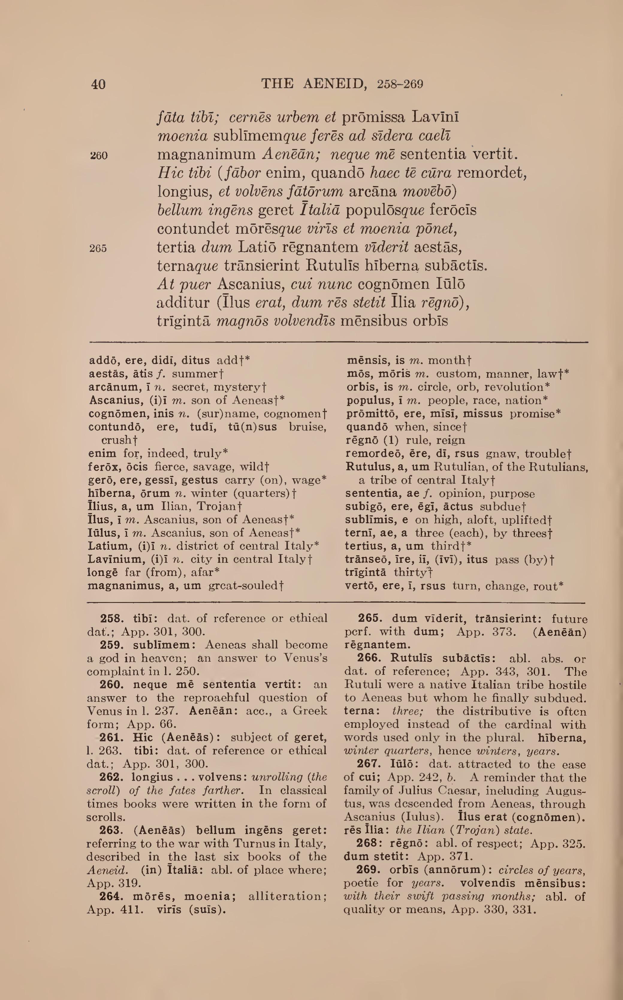
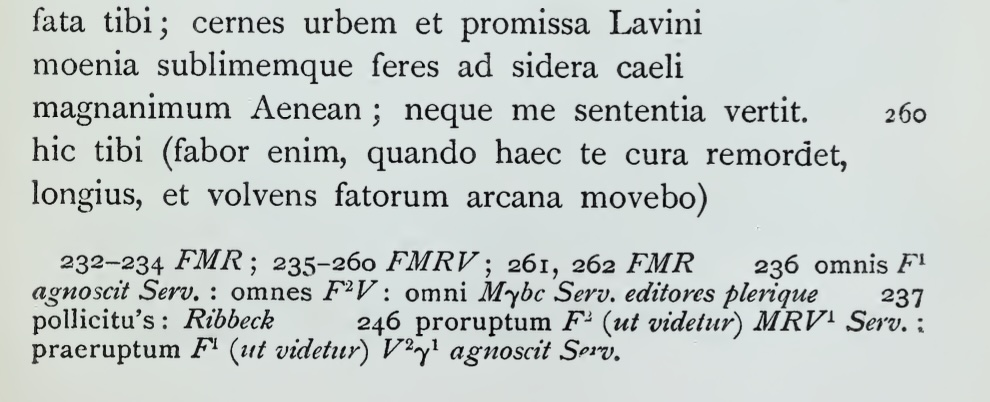
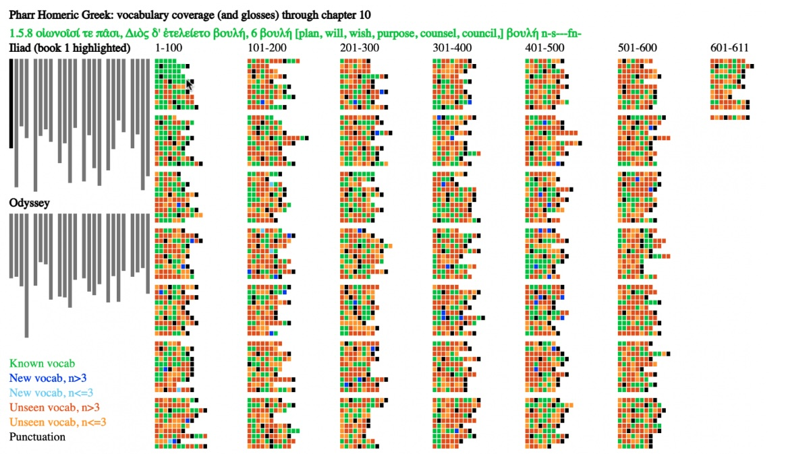
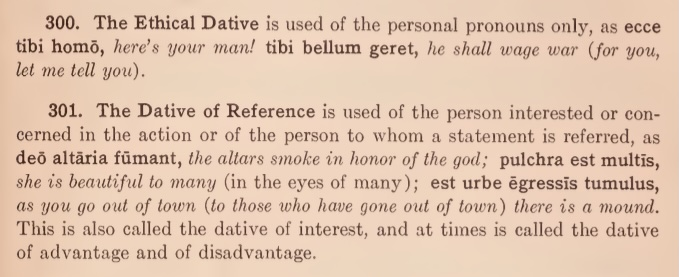

# PharrVergil

This repository includes work for a possible digital version of Clyde Pharr's [1930 edition of Vergil's Aeneid](https://archive.org/details/vergilsaeneidboo00virg_0) (books 1-6). Pharr was one of the most thoughtful teachers of Greek and Latin in the twentieth century. His [Beginning Homeric Greek book](https://archive.org/details/PharrBeginningHomericGreek1920), publishedin 1920, was pioneering piece of data-driven work and allows learners to begin engaging with the opening of the Iliad within a few weeks of study (or sooner in an intensive setting).

Pharr covers the first half of the Aeneid.
* Can we use content in Pharr as training data and generate useful glosses and grammatical tags for the second half?
* Some of what Pharr did by hand can now be done automatically (e.g., counting vocabulary items) but Pharr's work on visualization is a foundational starting point for us now almost a hundred years later.

Pharr includes (1) the text, (2) a running vocabulary list, and (3) a grammatical commentary.

# 1. The Text



The Latin text is based on the 1900 Hirtzel Oxford Classical Text.



Pharr, however, augmented the edition (p. v).
* He added long-marks
* He differentiated vocalic and syllabic i/j and u/v.
* He used spellings such as relligio, relligiosus, relliquiae "to represent more accurately the pronunciation of these words in Vergil's day."

OCR systems such as Tesseract cannot (at least given the models that we are using) capture the long-marks. The uncorrected results for Aen. 1.258-1.262 are:

```
fata tibi; cernes urbem et promissa Lavini
moenia sublimemque feres ad sidera. caeli

260

magnanimum Aenéün; neque mé sententia vertit.

Hic tibi ( fábor enim, quando haec tX cüra remordet,
```

The long marks could be added automatically with reasonable accuracy using a Large Language Model or more traditional procedural program. The results would not be perfect and someone would have to proofread the results if we wanted learners to have well-curated data.

# 2. The Running Vocabulary

In addition, Pharr added features that are much more challenging to calculate with the tools of print.

Pharr prints what he judges to be core vocabulary in *italics*. Although this feature is not included in the digitized versions that we have seen, the back of the print edition apparently contained a brief list of these core items that could be unfolded and viewed while students read the text. It is not clear whether Pharr used frequency to select the core vocabulary.

> This use of italics serves several distinct purposes. **First**, it indicates to the student where he must
look for the meaning of these words, whether in the special list or in
one of the vocabularies at the foot of the page. In the **second** place,
the difference in type assists in impressing these more important words
on the memory without as much conscious effort as has ordinarily
been needed and hence, perhaps, removes an element of discouragement from the task. The word list **also** furnishes convenient material
for the use of teachers who still prefer to require their students to
memorize the most important words in their text.

In addition to italics, Pharr used two other markers to annotate the vocabulary (p. 14):

> \* the asterisk in the vocabulary shows that the Latin word appears ten or more times in Books I-VI of the Aeneid.

> † the dagger in the vocabulary indicates the first appearance of the Latin word in Books I-VI of the Aeneid.

Now, given access to treebanks, we can calculate automatically whether a dictionary word appears N or more times in any given annotated corpus and we can also determine whether this is the first time that a given word has appeared.

In 2022, we reported work (inspired by Pharr's Homeric Greek) designed to visualize vocabulary items that appear more than N times and that are new. (For a more detailed description, see [here](https://sites.tufts.edu/perseusupdates/2022/04/21/visualizing-progress-in-a-historical-language-2/).) Since we were working with just Iliad book 1 (vs. six books of the Aeneid), we chose 3 rather than 10 as our cutoff point.

)

Colors were chosen based on the recommendations of Bang Wong [“Points of View: Color Blindness,” Nature Methods 8 (2011)] to minimize the impact of different forms of color blindness to make the color palette of visualization as accessible as possible. Colors describe six different features:

1. Vocabulary items that students have seen so far (in figure 1, the first 10 chapters of Pharr’s Homeric Greek) are lime green.
2. Vocabulary items introduced in the most recent lesson (chapter 10 of Pharr’s Homeric Greek) that appear more than 3 times in Iliad 1 appear as blue.
3. Vocabulary items introduced in the most recent lesson that appear 3 or less times in Iliad 1 appear as light sky-blue. The goal is to help learners prioritize the vocabulary on which they focus, emphasizing more active command for more common words.
4. Vocabulary items that learners have not encountered and that will appear more than 3 times in Iliad 1 appear as vermilion (a darker reddish color). Learners can skip ahead and see which frequent terms appear.
5. Vocabulary items that learners have not encountered and that will appear 3 times or less in Iliad 1 appear as orange.
6. Punctuation marks are listed as black. This allows readers to get an overview of sense breaks in the poetry (insofar as editors have chosen to represent these sense breaks with punctuation). At present, every form of punctuation is marked. It may well make more sense to include only full stops (and not commas) as a default.

The main section of the visualization presents one small box for each word in the Iliad 1. The length of each row reflects the number of words in each line. There are breaks between every 10 lines and each column contains up to 100 lines.

# 3. The commentary and in-book grammar

The most useful -- and difficult to replicate digitally -- feature in Pharr may be the commentary with its links to the grammar at the back of the book. 

The commentary, for example, not only states that *tibi* in line 258 is a dative of reference or ethical dative but also includes links to paragraphs 300 and 301 (App. 300, 300) to the grammar at the back of the book. With an uncorrected OCR-generated text, we can already see that there are 24 other references to App. 301 and 4 to App. 300.



We can now link these back of the book grammatical paragraphs to each and every labelled instance. There are at least two benefits. First, this gives learners concrete examples. Second, learners can see how frequent any given feature is and thus learn to identify those features which they need to master. At least some of the grammatical features described in the back of the book are never cited in the appendix and learners should be able to see which grarmmatical points of immediate importance and which are not yet relevant.